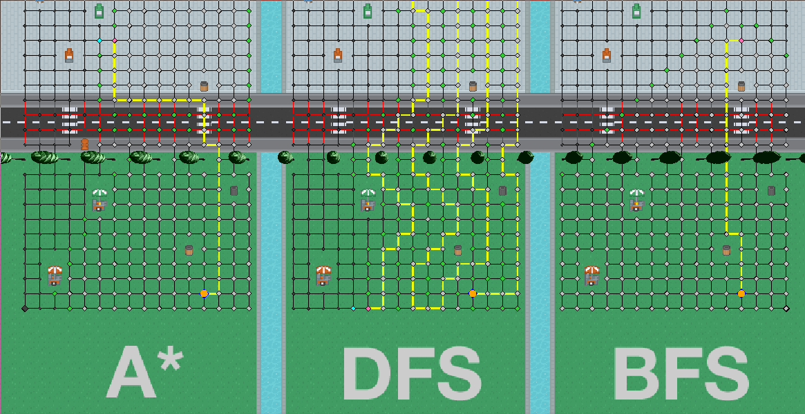

# Team project - B3



## Running the program

This application uses gradle to manage dependencies, and can be built and run by using the provided script ```gradlew```. These dependencies will automatically be downloaded, so an internet connection is required. This process can take a couple of minutes to complete, depending on the speed of your internet connection and system.

To run unit tests, use ```./gradlew test```

To run the application, use ```./gradlew run```

